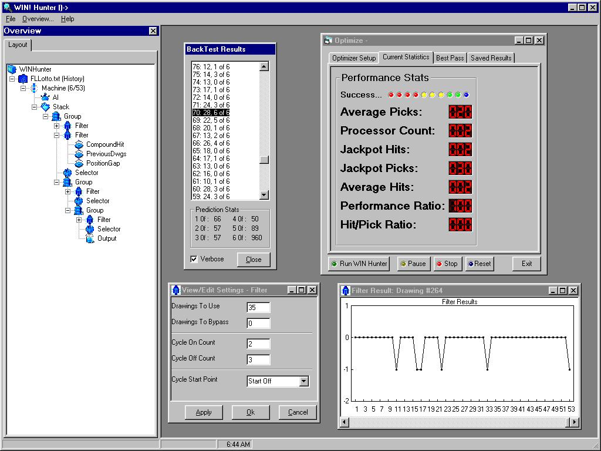

## WINHunter Lottery Prediction and Artificial Intelligence

### Description

WINHunter is a lottery analysis tool with many programming features. IT is designed to be modular, and to allow users to add functions to an existing compiled program via ActiveX components.

WINHunter is a demonstration of off the shelf components to do a complex programming task. Keep in mind this prject is being submitted in an alpha form, so it tends to sometimes be buggy *wink*. But all in all, most of the functions work fine.

The artificial intelligence module uses fuzzy logic to try and find the best methods to predict the lottery it is analyzing.

Also, WINHunter uses XML technolgy to load and save configuration data.

This source code is free, so enjoy! Vote for me!
 
### More Info
 
There are several projects that work together once commpiled. Be sure to folow the instructions in the compileprojects.txt file included in the zip file.

COMPILE THE .DLL FILES IN THE CORRECT ORDER! I cannot stress this enough. BE sure once you compile one and register it, you check the rest of the projects for the correct reference to the library.

There are too many to list.

Program will compain of automation error if the .dll files are not compiled in the correct order. They are inter-dependent (I will be looking into fixing that problem later on.)

             |
---                |---
**Submitted On**   |2002-06-25 15:51:52
**By**             |[Andrew Reed](https://github.com/Planet-Source-Code/PSCIndex/blob/master/ByAuthor/andrew-reed.md)
**Level**          |Advanced
**User Rating**    |5.0 (20 globes from 4 users)
**Compatibility**  |VB 6\.0
**Category**       |[Complete Applications](https://github.com/Planet-Source-Code/PSCIndex/blob/master/ByCategory/complete-applications__1-27.md)
**World**          |[Visual Basic](https://github.com/Planet-Source-Code/PSCIndex/blob/master/ByWorld/visual-basic.md)
**Archive File**   |[WINHunter\_987076252002\.zip](https://github.com/Planet-Source-Code/andrew-reed-winhunter-lottery-prediction-and-artificial-intelligence__1-36268/archive/master.zip)

### API Declarations

No windows API calls used here.

